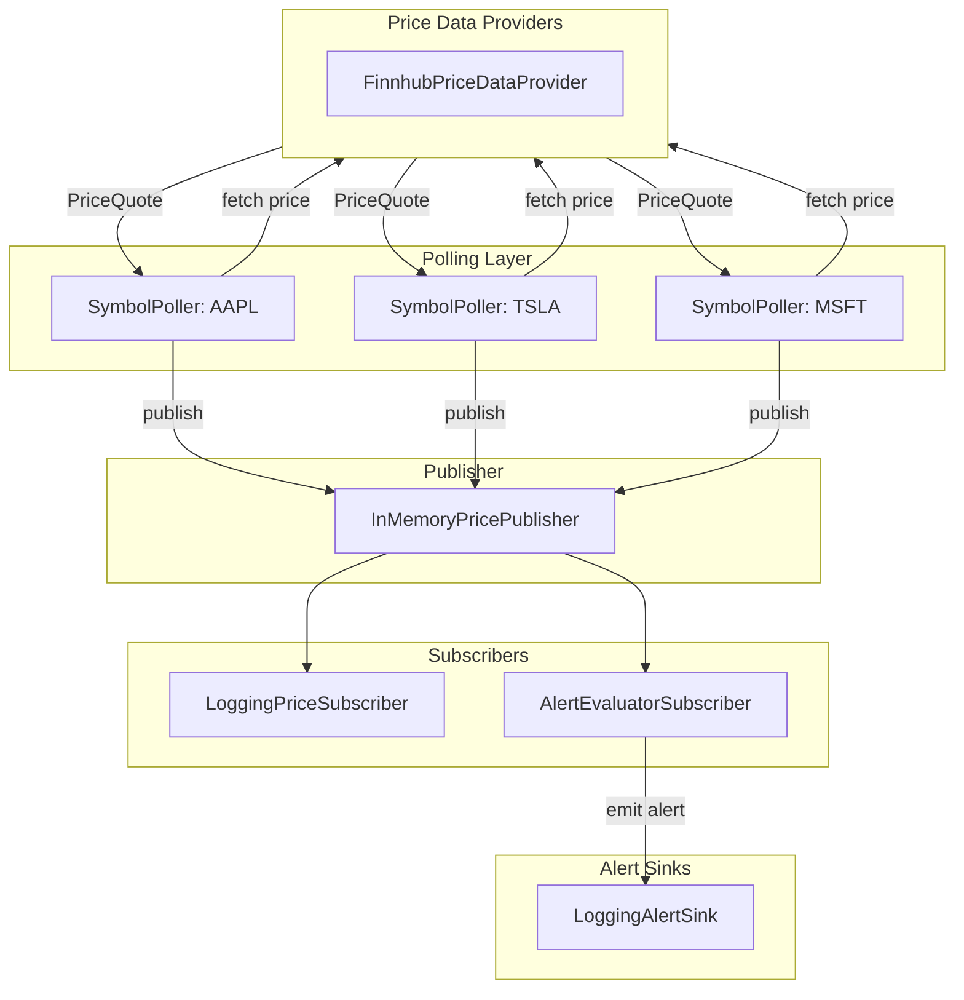

# Secure-Stock-Price-Alert-System

A real-time stock price alert system built in Java, focused on clean OOP design, the Observer pattern, multithreading, reliability (retry with exponential backoff), and extensibility.

### Features
- Multithreaded per‑symbol polling workers
- Observer pattern (PricePublisher → PriceSubscriber)
- Pluggable data providers (Finnhub, and future alternatives)
- Retry with exponential backoff for transient failures
- Threshold alerts (above/below) with crossing detection (no alert spam)
- Logging sink for alerts/events

### Security notes
API keys are read from the environment (`FINNHUB_API_KEY`), not hardcoded. Local secrets files (`.env`, `application.yml`, etc.) are gitignored. Provider errors treat auth failures as fatal (no endless retry on bad credentials).

### Architecture

> [!NOTE]
> Each SymbolPoller (one per symbol) fetches prices from the PriceDataProvider, publishes PriceQuote, updates through the InMemoryPricePublisher, and subscribers either log updates (LoggingPriceSubscriber) or evaluate rules (AlertEvaluatorSubscriber) to emit alerts to the LoggingAlertSink.

### Project Milestones
- Domain model + interfaces
- Observer wiring + in-memory publisher
- Multithreaded pollers + graceful shutdown
- Finnhub provider + JSON parsing
- Retry/backoff reliability
- Crossing threshold alerts

### Getting started
- #### Prereqs
  - Java 17
  - Maven
  - A [Finnhub](https://finnhub.io) API key (free tier is fine)
- #### Configure
  - Set your API key in the environment (required — the app fails fast if it is missing):
    ```bash
    export FINNHUB_API_KEY=your_key_here
    ```
  - For VS Code, you can use a local `.env` file and a launch config with `envFile` (`.env` is gitignored).
- #### Run
  - Compile:
    ```bash
    mvn -q compile
    ```
  - Run the main class `com.salem.stockalert.App` from your IDE (Run/Debug), with `FINNHUB_API_KEY` set.
  - Or from the project root after `mvn compile`:
    ```bash
    java -cp "target/classes:$(mvn -q dependency:build-classpath -Dmdep.includeScope=compile -Dmdep.outputFile=/dev/stdout)" com.salem.stockalert.App
    ```
  - You should see price logs and, when a rule crosses its threshold, an alert line. Press Ctrl+C to stop.

### Tech
Java 17, Maven, Finnhub API, Gson, OOP, Observer pattern, multithreading, retry/backoff
